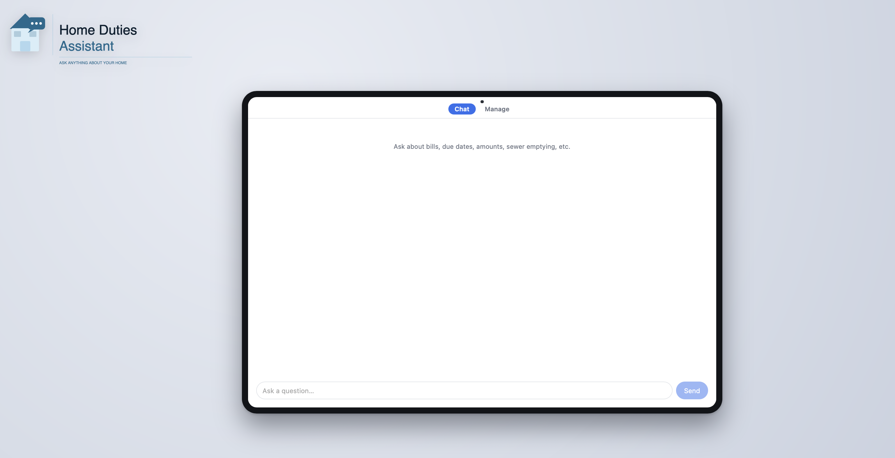
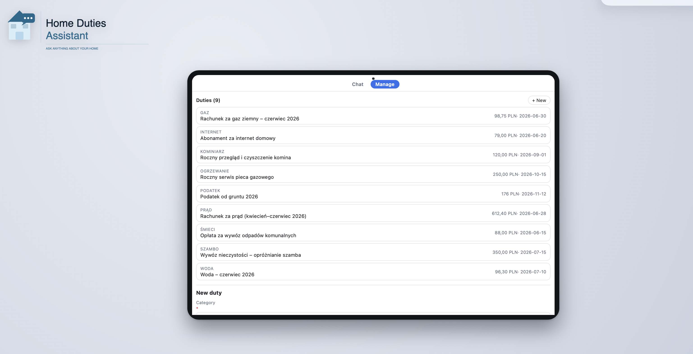

# Home Duties Assistant

A **local, offline RAG assistant** for household duties — bills, due dates, sewer emptying, and the rest of the things that are easy to forget. Your facts live in plain YAML, get embedded into PostgreSQL + pgvector, and are answered by a local Ollama LLM. Nothing leaves your machine.

> The bundled sample knowledge base happens to be in Polish, which drives a few retrieval choices (see [Hybrid retrieval](#hybrid-retrieval)). The app itself is language-agnostic — point it at your own facts in any language.

```
You ▸ how much is the electricity bill and when is it due?
🔎 searching…
AI  ▸ The electricity bill (Apr–Jun 2026) is 612.40 PLN,
      due 28 June 2026 (Tauron, paid by direct debit).
```

## Screenshots

| Chat | Manage duties |
|------|---------------|
|  |  |

## How it works

```
data/*.yaml ──▶ DataLoader ──▶ embed ──▶ PostgreSQL + pgvector
                                              │
   your question ──▶ embed ──▶ hybrid search (top-K facts) ──┘
                                      │
                                      ▼
                          Ollama LLM ──▶ streamed answer
```

1. **Ingest** — every `*.yaml` under `data/` becomes a `Duty`. Each duty is rendered to one canonical sentence that is *both* embedded and later shown to the model, then upserted into Postgres.
2. **Retrieve** — your question is embedded and matched against stored facts using **hybrid search** (lexical + vector, fused with Reciprocal Rank Fusion).
3. **Answer** — the top-K facts are pinned into a system prompt and the local LLM streams an answer grounded *only* in those facts.

## Prerequisites

- **[.NET 10 SDK](https://dotnet.microsoft.com/)**
- **Docker** (for PostgreSQL + pgvector)
- **[Ollama](https://ollama.com/)** running locally, with a chat model and an embedding model pulled. Configure which ones in `appsettings.json` (see [Configuration](#configuration)), then:
  ```bash
  ollama pull <your-chat-model>
  ollama pull <your-embedding-model>
  ```

## Quick start

```bash
# 1. Start the vector database (from the repo root)
docker compose -f HomeDutiesAssistant/docker-compose.yml up -d

# 2. Make sure Ollama is running at http://localhost:11434

# 3. Run the console chat — it auto-ingests on first run if the DB is empty
cd HomeDutiesAssistant
dotnet run
```

Ask questions in natural language; type `exit` to quit.

## Running

### Console front-end

```bash
cd HomeDutiesAssistant

dotnet run               # chat mode (default); auto-ingests if the DB is empty
dotnet run -- chat       # explicit chat mode
dotnet run -- ingest     # (re)embed all data/*.yaml and upsert, then exit
```

### Web front-end (Blazor Server)

```bash
cd HomeDutiesAssistant.Web
dotnet run               # http://localhost:5080
```

- **`/`** — chat UI with streamed answers and the sources behind each one.
- **`/manage`** — create, edit, and delete duties in the browser. Saving re-embeds the fact instantly, so it's searchable in chat right away.

Ingestion in the web app is **automatic**: a scheduled job rebuilds the knowledge base on boot and every 6 hours.

## Adding your own duties

Edit (or add) a YAML file under `HomeDutiesAssistant/data/`. Each entry is a sparse record — only `category` and `title` are required:

```yaml
- category: electricity
  title: Electricity bill (Apr–Jun 2026)
  provider: Tauron
  amount: 612.40
  currency: PLN
  dueDate: 2026-06-28
  frequency: quarterly
  notes: Estimated usage 1100 kWh. Paid by direct debit.
```

The `title` is the unique key — re-ingesting the same title updates that record instead of duplicating it.

After editing the YAML:
- **Console:** run `dotnet run -- ingest`.
- **Web:** wait for the next scheduled run (or restart) — or just use the `/manage` page, which re-embeds on save.

> The console project owns the canonical `data/` files; the web project links to the same files, so there's a single source of truth.

## Configuration

Settings live in `appsettings.json` (one per front-end — keep the `Ollama` / `Database` / `Rag` sections in sync):

| Section    | Key                   | Notes                                                          |
|------------|-----------------------|----------------------------------------------------------------|
| `Ollama`   | `BaseUrl`             | Ollama endpoint (default `http://localhost:11434`)             |
| `Ollama`   | `ChatModel`           | Model used to generate answers — must be pulled in Ollama      |
| `Ollama`   | `EmbeddingModel`      | Model used for embeddings — must be pulled in Ollama           |
| `Database` | `ConnectionString`    | Matches `docker-compose.yml`                                   |
| `Rag`      | `TopK`                | How many facts are fed to the model per question               |
| `Rag`      | `EmbeddingDimensions` | Vector size — must match the embedding model and the DB column |
| `Rag`      | `LexicalWeight`       | Weight of the lexical signal in fusion                         |
| `Rag`      | `VectorWeight`        | Weight of the vector signal in fusion                          |

Swapping the embedding model? Update `EmbeddingModel`, set `EmbeddingDimensions` to match it, adjust the embedding task prefixes if your model needs them, and recreate the `duties` table if the dimensions change.

## Hybrid retrieval

Pure vector search can struggle when the embedding model is weak on the knowledge base's language (as is the case for the bundled Polish sample data). So retrieval **fuses two rankings** with Reciprocal Rank Fusion (RRF):

```
score = LexicalWeight / (RrfK + lexicalRank) + VectorWeight / (RrfK + vectorRank)
```

- **Lexical rank** — `pg_trgm` `word_similarity` over the category (0.6) and content (0.4). Robust when a question shares words with a fact.
- **Vector rank** — pgvector cosine distance, for semantic recall.

RRF combines by *position* rather than raw scores, which lets two signals on different scales work together. The lexical signal is weighted higher to compensate for weaker-language embeddings — if you swap in a strong multilingual embedding model, raise `VectorWeight` relative to `LexicalWeight`.

## Project layout

| Project                     | Role                                                                 |
|-----------------------------|----------------------------------------------------------------------|
| `HomeDutiesAssistant.Core`  | Transport-agnostic RAG core: models, options, pgvector access, services |
| `HomeDutiesAssistant`       | Console front-end (Spectre.Console) — owns the `data/` YAML and `docker-compose.yml` |
| `HomeDutiesAssistant.Web`   | Blazor Server front-end — chat UI, `/manage` CRUD page, scheduled ingestion |

Build everything:

```bash
dotnet build HomeDutiesAssistant.sln
```

There are no tests and no linter configured in this repo.

## Tech stack

.NET 10 · PostgreSQL 17 + [pgvector](https://github.com/pgvector/pgvector) · [Ollama](https://ollama.com/) · Blazor Server · [Quartz.NET](https://www.quartz-scheduler.net/) · [Spectre.Console](https://spectreconsole.net/) · [YamlDotNet](https://github.com/aaubry/YamlDotNet)