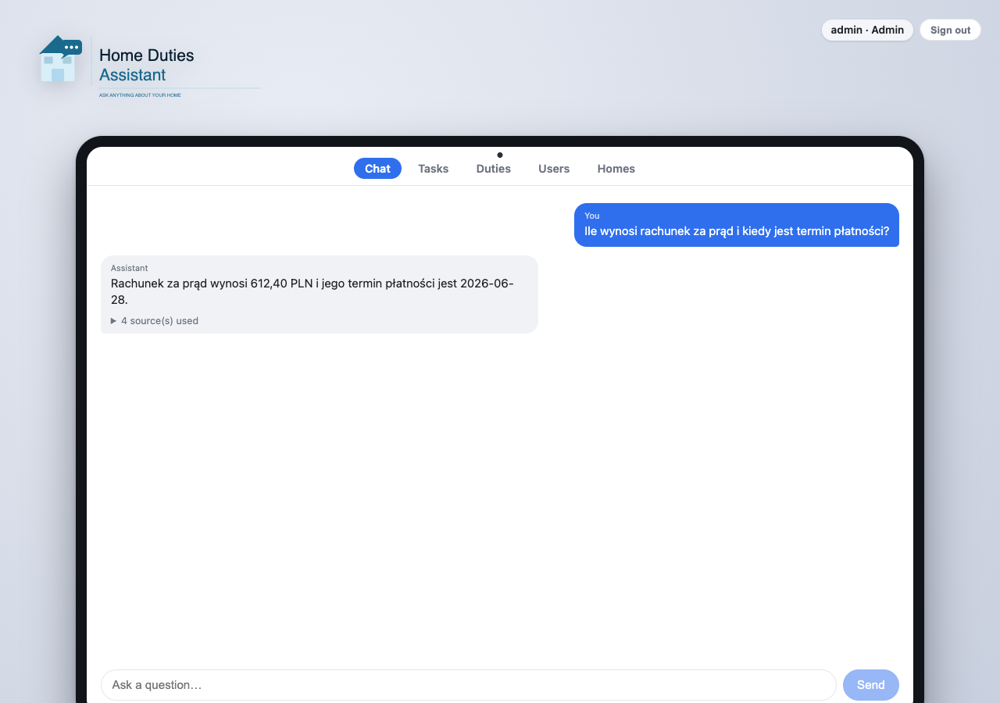
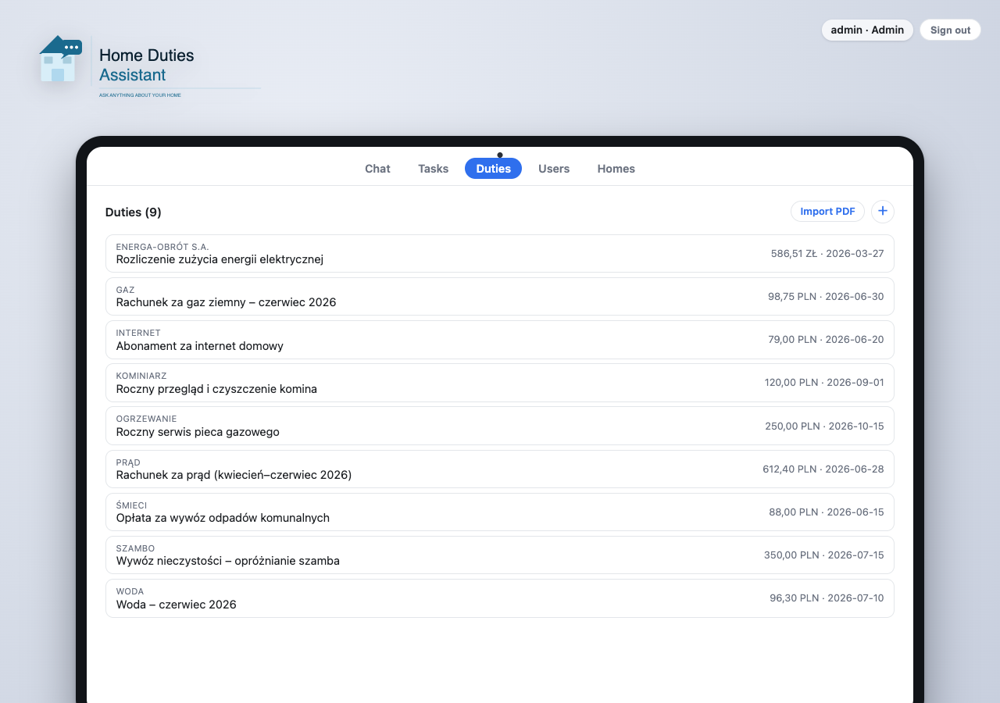

# Home Duties Assistant

A **local, offline RAG assistant** for household duties — bills, due dates, sewer emptying, and the rest of the things that are easy to forget. Your facts live in plain YAML, get embedded into PostgreSQL + pgvector, and are answered by a local Ollama LLM. Nothing leaves your machine.

> The bundled sample knowledge base happens to be in Polish, which drives a few retrieval choices (see [Hybrid retrieval](#hybrid-retrieval)). The app itself is language-agnostic — point it at your own facts in any language.

```
You ▸ how much is the electricity bill and when is it due?
🔎 searching…
AI  ▸ The electricity bill (Apr–Jun 2026) is 612.40 PLN,
      due 28 June 2026 (Tauron, paid by direct debit).
```

## Screenshots

| Chat | Manage duties |
|------|---------------|
|  |  |

## How it works

```
data/*.yaml ──▶ DataLoader ──▶ embed ──▶ PostgreSQL + pgvector
                                              │
   your question ──▶ embed ──▶ hybrid search (top-K facts) ──┘
                                      │
                                      ▼
                          Ollama LLM ──▶ streamed answer

bill.pdf ──▶ PdfPig (text layer) ──▶ Phi-4-mini (ONNX Runtime) ──▶ JSON ──▶ pre-filled Duty
                                                                               │
                                                  review & save on /duties ──▶ embed ──▶ pgvector
```

1. **Ingest** — every `*.yaml` under `data/` becomes a `Duty`. Each duty is rendered to one canonical sentence that is *both* embedded and later shown to the model, then upserted into Postgres.
2. **Retrieve** — your question is embedded and matched against stored facts using **hybrid search** (lexical + vector, fused with Reciprocal Rank Fusion).
3. **Answer** — the top-K facts are pinned into a system prompt and the local LLM streams an answer grounded *only* in those facts.
4. **Extract (optional, web only)** — a PDF bill uploaded on `/duties` is turned into text with **PdfPig** (text layer only, no OCR). A local **Phi-4-mini-instruct** model running in-process on **ONNX Runtime GenAI** (CPU, int4) reads that text and returns JSON — category, title, provider, total amount, ISO currency, due date, frequency, notes — which pre-fills a new duty for you to review. Saving embeds it like any other fact. Generation is greedy (temperature 0), the model is loaded once as a singleton, and requests are serialized. Without the model configured, the raw text lands in Notes instead. See [Importing bills from PDF](#importing-bills-from-pdf-optional).

## Prerequisites

- **[.NET 10 SDK](https://dotnet.microsoft.com/)**
- **Docker** (for PostgreSQL + pgvector)
- **[Ollama](https://ollama.com/)** running locally, with a chat model and an embedding model pulled. Configure which ones in `appsettings.json` (see [Configuration](#configuration)), then:
  ```bash
  ollama pull <your-chat-model>
  ollama pull <your-embedding-model>
  ```
- **Phi-4-mini-instruct ONNX weights** *(optional — only for PDF bill extraction)*, ~4.6 GB, fetched once from Hugging Face into the git-ignored `models/` folder:
  ```bash
  pip install huggingface_hub
  hf download microsoft/Phi-4-mini-instruct-onnx \
      --include "cpu_and_mobile/cpu-int4-rtn-block-32-acc-level-4/*" \
      --local-dir models/phi4
  ```
  Skip this and PDF import still works, just without auto-filled fields — see [Importing bills from PDF](#importing-bills-from-pdf-optional).

## Quick start

First, from the repo root, create a `.env` with the stack's secrets, and make sure Ollama is running:

```bash
cat > .env <<'EOF'
POSTGRES_PASSWORD=home
JWT_SIGNING_KEY=change-me-to-a-random-string-of-at-least-32-bytes
SEQ_ADMIN_PASSWORD=home
EOF
# ...and make sure Ollama is running at http://localhost:11434
```

**Web app** — run the whole stack in Docker (no .NET SDK needed):

```bash
docker compose up -d --build
```

Open **https://localhost** (accept the self-signed certificate) and sign in as **`admin` / `ChangeMe!2026`** — change it after first login. See [Self-hosting](#self-hosting-on-your-network) for LAN/domain access, structured logs (Seq), and pointing at Ollama on another machine.

**Console** — a terminal chat you run directly (handy for development); it needs only the database:

```bash
docker compose up -d pgvector            # just the vector DB
cd HomeDutiesAssistant && dotnet run      # auto-ingests on first run
```

Ask questions in natural language; type `exit` to quit.

## Running

### Console front-end

```bash
cd HomeDutiesAssistant

dotnet run               # chat mode (default); auto-ingests if the DB is empty
dotnet run -- chat       # explicit chat mode
dotnet run -- ingest     # (re)embed all data/*.yaml and upsert, then exit
```

### Web front-end (Blazor Server)

For deployment, run the containerized stack (see [Self-hosting](#self-hosting-on-your-network)). For **development**, run it directly with the DB up (`docker compose up -d pgvector`) — dev credentials and a dev JWT key already live in `appsettings.Development.json`:

```bash
cd HomeDutiesAssistant.Web
dotnet run               # http://localhost:5081
```

Every page requires sign-in. New users **self-register** at `/register`, which creates their own **Home** (each user belongs to one Home; all duties, tasks, and chat are scoped to it). The seeded super-admin is **`admin` / `ChangeMe!2026`** — change it after first login.

Access is by role — `Read` ⊂ `Manage` ⊂ `HomeAdmin` ⊂ `Admin` (each user holds exactly one role; a policy accepts that role and any higher one). `Read`/`Manage`/`HomeAdmin` act **within the user's own Home**; `Admin` is the **global super-admin** across all Homes:

- **`/`** — chat UI with streamed answers and the sources behind each one (`Read`).
- **`/duties`** — create, edit, and delete duties in the browser. Saving re-embeds the fact instantly, so it's searchable in chat right away (`Manage`).
- **`/tasks`** — a simple task list with optional due dates, statuses, and drag-and-drop ordering (`Manage`).
- **`/manage/users`** — manage the members of your own Home and their roles (`HomeAdmin`).
- **`/manage/homes`** — super-admin view of every Home: create or delete whole Homes and users across the instance (`Admin`).

Ingestion in the web app is **automatic**: a scheduled job rebuilds the knowledge base on boot and every 6 hours.

## Self-hosting on your network

Run the web app on an always-on machine (a home server, a spare box) and reach it from any phone or laptop on the same network. The repo-root `docker-compose.yml` brings up the **full stack**: PostgreSQL + pgvector, the web app (built from the `Dockerfile`), a **Caddy** reverse proxy that terminates HTTPS, and **Seq** for structured logs.

First create a `.env` in the repo root with the required secrets (the stack refuses to start without them):

```bash
cat > .env <<'EOF'
POSTGRES_PASSWORD=change-me
JWT_SIGNING_KEY=change-me-to-a-random-string-of-at-least-32-bytes
SEQ_ADMIN_PASSWORD=change-me
SITE_ADDRESS=localhost         # a real domain -> automatic Let's Encrypt HTTPS
EOF

docker compose up -d --build
```

Caddy serves the app over HTTPS at **`https://<SITE_ADDRESS>`** (a real domain gets an automatic Let's Encrypt certificate; `localhost` uses Caddy's internal self-signed CA). Sign in with the seeded **`admin` / `ChangeMe!2026`** and change the password. If ports 80/443 are already taken, set `HTTP_PORT`/`HTTPS_PORT` in `.env`.

For LAN access, set `SITE_ADDRESS` to the server's address (or a domain pointed at it) — find it with `ipconfig getifaddr en0` (macOS) or `hostname -I` (Linux) — and open that host from other devices.

Structured logs are searchable in **Seq** at `http://localhost:8082` (override with `SEQ_UI_PORT`), using the `SEQ_ADMIN_PASSWORD` you set.

**Ollama still runs outside the stack** (it's not containerised here). By default the app looks for it on the Docker host at `host.docker.internal:11434`. If Ollama lives on another machine, edit `Ollama__BaseUrl` in `docker-compose.yml` to point at it (e.g. `http://192.168.1.50:11434`). Host-installed Ollama must listen on all interfaces (`OLLAMA_HOST=0.0.0.0`) for the container to reach it.

Useful commands:

```bash
docker compose logs -f web     # watch startup + the boot ingestion job
docker compose down            # stop (keeps the pgdata volume / your facts)
docker compose up -d --build   # rebuild & restart after code or data changes
```

> First load can take a few seconds while the boot job embeds the YAML.

### Before a production deployment: lock down published ports

The default `docker-compose.yml` is tuned for development: it publishes **PostgreSQL (`5432`)** and the **Seq UI (`8082`)** on *all* host interfaces, so anyone who can reach the machine can hit the database and the logs directly. Docker's port publishing also bypasses host firewalls such as `ufw`, so a firewall rule alone won't save you. On any machine reachable from outside your trusted network, only Caddy (`80`/`443`) should be public.

Before deploying, create a `docker-compose.override.yml` next to `docker-compose.yml`. Compose picks it up automatically on every `docker compose` command:

```yaml
# docker-compose.override.yml — production: only Caddy is publicly reachable.
services:
  pgvector:
    ports: !override
      - "127.0.0.1:5432:5432"   # host-local only (for backups/psql); use !reset [] to drop entirely
  seq:
    ports: !override
      - "127.0.0.1:8082:80"     # reach the UI via an SSH tunnel: ssh -L 8082:localhost:8082 <server>
```

`!override` replaces the base file's port list instead of merging with it (a plain `ports:` would *add* to the published ports). It needs Docker Compose ≥ 2.24.4. The web container needs no change: it's only `expose`d, and Postgres and Seq stay reachable from the web container over the compose network either way. Check the result with `docker compose config` and `docker compose ps`: only `80`/`443` should be bound to `0.0.0.0`.

## Adding your own duties

Edit (or add) a YAML file under `HomeDutiesAssistant/data/`. Each entry is a sparse record — only `category` and `title` are required:

```yaml
- category: electricity
  title: Electricity bill (Apr–Jun 2026)
  provider: Tauron
  amount: 612.40
  currency: PLN
  dueDate: 2026-06-28
  frequency: quarterly
  notes: Estimated usage 1100 kWh. Paid by direct debit.
```

The `title` is the unique key — re-ingesting the same title updates that record instead of duplicating it.

After editing the YAML:
- **Console:** run `dotnet run -- ingest`.
- **Web:** wait for the next scheduled run (or restart) — or just use the `/duties` page, which re-embeds on save.

> The console project owns the canonical `data/` files; the web project links to the same files, so there's a single source of truth.

## Importing bills from PDF (optional)

The Duties page has an **Import PDF** button: upload a text-layer bill (no OCR) and a local **Phi-4-mini-instruct** model (ONNX Runtime) extracts the provider, amount, due date, etc. into a pre-filled duty for you to review and save.

This needs the model weights on disk (~4.6 GB). They are **not** in git and **not** baked into the Docker image — you pull them once and they're mounted at runtime:

```bash
pip install huggingface_hub
hf download microsoft/Phi-4-mini-instruct-onnx \
    --include "cpu_and_mobile/cpu-int4-rtn-block-32-acc-level-4/*" \
    --local-dir models/phi4
```

That lands the model at `models/phi4/cpu_and_mobile/cpu-int4-rtn-block-32-acc-level-4/` (the repo-local `models/` folder is git-ignored) — the default location the web app looks for (PDF import is web-only; the console doesn't use the model):

- **Docker:** `docker-compose.yml` bind-mounts that directory read-only into the web container at `/models/phi4` and sets `Onnx__ModelPath` to it. Point `ONNX_MODEL_DIR` in `.env` at a different host path if you keep the weights elsewhere.
- **Local dev:** `appsettings.Development.json` sets `Onnx:ModelPath` to the same repo-local path.

**The feature is optional.** Remove the `Onnx` section (and the compose mount) and PDF import still works — it just drops the extracted raw text into the duty's Notes for you to fill in by hand, instead of auto-filling the fields.

## Configuration

Settings live in `appsettings.json` (one per front-end — keep the `Ollama` / `Database` / `Rag` sections in sync):

| Section    | Key                   | Notes                                                          |
|------------|-----------------------|----------------------------------------------------------------|
| `Ollama`   | `BaseUrl`             | Ollama endpoint (default `http://localhost:11434`)             |
| `Ollama`   | `ChatModel`           | Model used to generate answers — must be pulled in Ollama      |
| `Ollama`   | `EmbeddingModel`      | Model used for embeddings — must be pulled in Ollama           |
| `Database` | `ConnectionString`    | Matches `docker-compose.yml`                                   |
| `Rag`      | `TopK`                | How many facts are fed to the model per question               |
| `Rag`      | `EmbeddingDimensions` | Vector size — must match the embedding model and the DB column |
| `Rag`      | `LexicalWeight`       | Weight of the lexical signal in fusion                         |
| `Rag`      | `VectorWeight`        | Weight of the vector signal in fusion                          |
| `Onnx`     | `ModelPath`           | Phi-4 ONNX model dir (web only; relative paths resolve from the solution root). Omit the section to disable extraction |
| `Onnx`     | `MaxLength`           | Max tokens (prompt + output) per extraction                    |

Swapping the embedding model? Update `EmbeddingModel`, set `EmbeddingDimensions` to match it, adjust the embedding task prefixes if your model needs them, and recreate the `duties` table if the dimensions change.

## Hybrid retrieval

Pure vector search can struggle when the embedding model is weak on the knowledge base's language (as is the case for the bundled Polish sample data). So retrieval **fuses two rankings** with Reciprocal Rank Fusion (RRF):

```
score = LexicalWeight / (RrfK + lexicalRank) + VectorWeight / (RrfK + vectorRank)
```

- **Lexical rank** — `pg_trgm` `word_similarity` over the category (0.6) and content (0.4). Robust when a question shares words with a fact.
- **Vector rank** — pgvector cosine distance, for semantic recall.

RRF combines by *position* rather than raw scores, which lets two signals on different scales work together. The lexical signal is weighted higher to compensate for weaker-language embeddings — if you swap in a strong multilingual embedding model, raise `VectorWeight` relative to `LexicalWeight`.

## Project layout

| Project                     | Role                                                                 |
|-----------------------------|----------------------------------------------------------------------|
| `HomeDutiesAssistant.Core`  | Transport-agnostic RAG core: models, options, pgvector access, services |
| `HomeDutiesAssistant`       | Console front-end (Spectre.Console) — owns the `data/` YAML and `docker-compose.yml` |
| `HomeDutiesAssistant.Web`   | Blazor Server front-end — chat UI, `/duties` + `/tasks` management, users/homes admin, scheduled ingestion |

Build everything:

```bash
dotnet build HomeDutiesAssistant.sln
```

There are no tests and no linter configured in this repo.

## Tech stack

.NET 10 · PostgreSQL 17 + [pgvector](https://github.com/pgvector/pgvector) · [Ollama](https://ollama.com/) · Blazor Server · [Quartz.NET](https://www.quartz-scheduler.net/) · [Spectre.Console](https://spectreconsole.net/) · [YamlDotNet](https://github.com/aaubry/YamlDotNet) · [ONNX Runtime GenAI](https://github.com/microsoft/onnxruntime-genai) · [PdfPig](https://github.com/UglyToad/PdfPig)